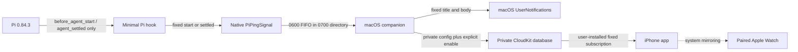

# Architecture

## Phase 1 data flow

The Pi hook reads no lifecycle event fields. `before_agent_start` opens the
duration window and `agent_settled` closes it only after Pi has no automatic
retry, compaction retry, or queued continuation left. Duplicate starts do not
reset the timer. Runs under 30 seconds are ignored.

## Components

| Component | Responsibility | Network behavior |
| --- | --- | --- |
| `PiPingCore` | Fixed copy, event type, two-signal protocol, duration gate | None |
| `PiPingSignal` | Validate and write one fixed local signal | None |
| `PiPingMac` | Listen locally, apply threshold, present Mac status and notifications | Cloud publishing requires valid private build configuration and explicit user enablement |
| `PiPingCloudKit` | Build one allowlisted rolling record and a fixed visual subscription | Explicit private container only |
| `PiPingIOS` | Check iCloud, request notifications, confirm APNs, and install the subscription | User-initiated setup only |
| Pi hook | Translate two documented Pi lifecycle events to native helper calls | None |

The tracked public build defaults CloudKit activation to `false` and rejects
placeholder container identifiers. An ignored private-local build override may
enable CloudKit without changing source. The Mac still requires a separate,
persisted user enable action. Phase 2 controls remain hard-coded to `false`.

## Apple delivery behavior

The Mac uses `UNUserNotificationCenter` with `.default` sound. CloudKit uses the
user's private database and a visual query subscription with the same fixed
copy and `default` sound. Every attention event overwrites one fixed rolling
record whose only application field is `occurredAt`. The subscription fires on
record creation and update, requests no record fields, and sends no background
content.

The Mac reports remote delivery as sent only after CloudKit accepts the record
write. This confirms the private-database write, not presentation on every
device. Normal iPhone notification routing determines whether the iPhone or
paired Watch alerts. Siri Announce Notifications remains an optional system
setting; PiPing does not implement speech or voice commands.

The current private development build has verified the complete path with both
an explicitly loaded hook and a newly started ordinary `pi` session: Pi settled,
the Mac notified, CloudKit accepted the rolling record, the iPhone notified, and
the paired Apple Watch mirrored the alert. Normal local use installs the
repository through Pi's user-package mechanism; no notification or control data
is added to Pi's configuration beyond the local package reference.

## Explicit exclusions

Phase 1 has no command model, action receiver, App Intent, notification action,
deep link, node presence, dashboard, project/file view, session metadata,
Tailscale dependency, terminal surface, approval surface, or arbitrary network
configuration.

A future action vocabulary is a separate security boundary and module. Nothing
in Phase 1 acts as a dormant return channel.
