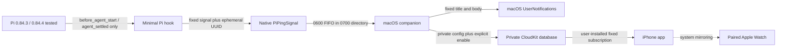

# Architecture

## Phase 1 data flow

The Pi hook reads no lifecycle event fields. It generates a random UUID for
each active lifecycle cycle, unrelated to Pi's persisted session identity.
Repeated starts before settlement retain that cycle's token; after a settlement
attempt, the next cycle always receives a fresh token so an abandoned Mac timer
cannot match a later run. `before_agent_start` opens the duration window and
`agent_settled` closes it only after Pi has no automatic retry, compaction retry,
or queued continuation left. The Mac tracks tokens independently, so
overlapping Pi processes can each notify. A newer `start` replaces stale state
only for the same still-active token. State is bounded to 256 active tokens and
expires after seven days; FIFO
input is decoded as a bounded stream so combined and split reads preserve whole
messages. The serialized delivery backlog is capped at 64 and the in-memory
unread-ID set at 256. Runs under the selected threshold are ignored.

## Components

| Component | Responsibility | Network behavior |
| --- | --- | --- |
| `PiPingCore` | Fixed copy, two-signal/opaque-token protocol, bounded stream decoder, multi-session duration gate | None |
| `PiPingSignal` | Validate and atomically write one fixed signal plus UUID | None |
| `PiPingMac` | Listen locally, apply threshold, present Mac status and notifications | Cloud publishing requires valid private build configuration and explicit user enablement |
| `PiPingCloudKit` | Build one allowlisted rolling record and a fixed visual subscription | Explicit private container only |
| `PiPingIOS` | Check iCloud, request notifications, confirm APNs, and install the subscription | User-initiated setup only |
| Pi hook | Translate two documented Pi lifecycle events and the current cycle's random UUID to native helper calls | None |

The tracked public build defaults CloudKit activation to `false` and rejects
placeholder container identifiers. The source-local builder forces those public
values even when an ignored private override exists, then applies ad-hoc
hardened-runtime signatures with no profile or entitlements. Separate guarded
validation/install/uninstall scripts refuse foreign canonical apps, preserve
bounded compressed recovery, and never enable CloudKit or mutate Apple-managed
notification databases. An ignored private-local build override may enable
CloudKit only through the separate Apple Development-signed path. The Mac still
requires a persisted user enable action. Phase 2 controls remain hard-coded to
`false`.

## Apple delivery behavior

The Mac uses `UNUserNotificationCenter` with `.default` sound. CloudKit uses the
user's private database and a visual query subscription with the same fixed
copy and `default` sound. Every attention event overwrites one fixed rolling
record whose only application field is `occurredAt`. The subscription fires on
record creation and update, requests no record fields, and sends no background
content.

The Mac serializes attention delivery so rapid completions cannot race updates
to the one rolling CloudKit record. It reports remote delivery as sent only
after CloudKit accepts that event's write. This confirms the private-database
write, not presentation on every device. Normal iPhone notification routing
determines whether the iPhone or paired Watch alerts. Siri Announce
Notifications remains an optional system setting; PiPing does not implement
speech or voice commands.

The menu-bar attention dot tracks the UUIDs of locally generated notification
requests in memory. PiPing registers one fixed, actionless notification category
with Apple's public `.customDismissAction` option. Clicking or dismissing a
PiPing notification acknowledges that exact request through the system delegate;
opening the PiPing menu acknowledges all. The category presents no action button
and no command channel. PiPing does not monitor terminal focus or window titles
and cannot infer the originating terminal without expanding the privacy boundary.

The current private development build has verified the complete path with both
an explicitly loaded hook and a newly started ordinary `pi` session: Pi settled,
the Mac notified, CloudKit accepted the rolling record, the iPhone notified, and
the paired Apple Watch mirrored the alert. Normal local use installs the
repository through Pi's user-package mechanism; no notification or control data
is added to Pi's configuration beyond the local package reference.

## Explicit exclusions

Phase 1 has no command model, user-visible notification action, App Intent,
deep link, node presence, dashboard, project/file view, Pi session metadata,
terminal identity, Tailscale dependency, terminal surface, approval surface, or
arbitrary network configuration. The ephemeral local correlation UUID conveys
no project or session content and is discarded from memory after settlement,
expiry, overflow reset, or app restart.

A future action vocabulary is a separate security boundary and module. Nothing
in Phase 1 acts as a dormant return channel.
