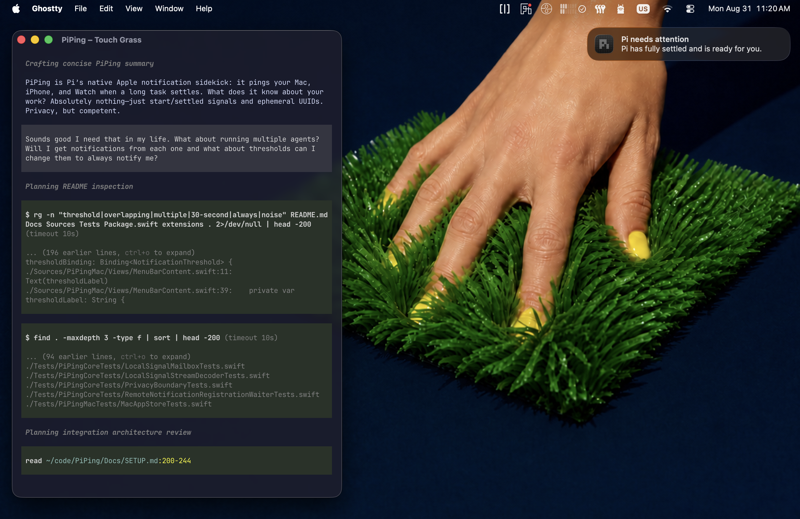

# PiPing

<picture>
  <source media="(prefers-color-scheme: dark)" srcset="Assets/Communication/piping-teaser-dark.webp">
  <source media="(prefers-color-scheme: light)" srcset="Assets/Communication/piping-teaser-light.webp">
  
</picture>

Stop watching the terminal. When a long-running Pi task has fully settled, PiPing
sends a simple notification to your Mac, so you can go do something else while
your agent works. With optional private Apple signing and CloudKit setup, the
same signal can also reach your iPhone and mirror to its paired Apple Watch — so
you can be outside and still know when Pi is ready for you.

The notification is always:

- **Pi needs attention**
- **Pi has fully settled and is ready for you.**
- the normal system notification sound

The message never includes your task, prompt, model output, code, project, or
file names. PiPing receives only a fixed `start` or `settled` signal and a random
per-cycle UUID so overlapping runs stay independent. That UUID exists briefly in
the Pi extension and Mac app, is not Pi's session identifier, and is never sent
to CloudKit. If remote delivery is enabled, CloudKit stores one timestamp; the
notification text is fixed in source and subscription configuration.

See [Privacy](Docs/PRIVACY.md) and the
[Threat model](Docs/THREAT_MODEL.md) for the complete boundary.

> PiPing is an independent community project and is not affiliated with or
> endorsed by Pi's maintainers. It is a convenience notification, not an alarm
> or safety-critical system. Phase 1 is intentionally one-way: no commands,
> replies, or approval actions.

## What you need

| | |
| --- | --- |
| **macOS** | macOS 26 or later |
| **Xcode** | Stable Xcode 26 or later at `/Applications/Xcode.app`; use the latest stable full Xcode available because Command Line Tools alone cannot compile the Icon Composer source |
| **Swift** | Swift tools 6.2 or later, supplied by the supported Xcode toolchain |
| **Node** | The Node runtime used by your existing Pi installation, with type-stripping support for hook tests |
| **Pi** | Tested with 0.84.3 and 0.84.4; newer releases are confirmed individually; see [tested compatibility](#tested-pi-compatibility) |
| **iPhone / Watch delivery** | Optional; iOS 26 or later plus your own Apple account, signing identity, and private CloudKit container |

The Apple version numbers above are minimum baselines, not exact-version locks.
Newer stable Apple releases are expected to work but are confirmed as they become
available. Pi compatibility remains version-specific because its extension
lifecycle APIs can change.

PiPing `0.1.0` is distributed as source. There is no public downloadable app
binary yet.

## Choose a path

| What you want | Start here |
| --- | --- |
| Mac notifications without an Apple account | [Mac-only local build](#mac-only-local-build) |
| Mac, iPhone, and paired Watch delivery | [Signed local build](#signed-local-build) |
| Tests and compile verification only | [Verify from source](#verify-from-source) |
| Try the Pi extension for one run without saving it | [One-run Pi trial](#one-run-pi-trial) |

Whichever app path you choose, install or temporarily load the Pi extension to
connect Pi's lifecycle events to the native Mac app.

## How it works

A small Pi extension translates the documented `before_agent_start` and
`agent_settled` lifecycle events into fixed signals. A bundled native helper
writes those signals to a protected same-user FIFO. The Mac app applies your
duration threshold and posts a local notification.

If you explicitly enable iPhone / Watch delivery in a privately signed build,
the Mac updates one rolling record in your private CloudKit database. The iPhone
app subscribes to that fixed record, and Apple can mirror its notification to a
paired Watch. There is no watchOS app.

See [Architecture](Docs/ARCHITECTURE.md) for the complete data flow.

## What it looks like in use

<picture>
  <source media="(prefers-color-scheme: dark)" srcset="Assets/Communication/piping-hero-dark.webp">
  <source media="(prefers-color-scheme: light)" srcset="Assets/Communication/piping-hero-light.webp">
  
</picture>

Your task details stay in Pi and the terminal. PiPing receives only the fixed
lifecycle signal needed to decide when to show the notification.

## Mac-only local build

This is the simplest functional path. It provides local Mac notifications
without an Apple account, signing identity, or CloudKit container. Full stable
Xcode is still required because the app uses Apple Icon Composer source.

From a trusted checkout:

```bash
./script/verify.sh
./script/build_source_local.sh
./script/install_source_local.sh --check
./script/install_source_local.sh --install
```

The installer uses the public development identity, keeps CloudKit disabled,
and refuses to replace a private, foreign, or future official app. Generated
archives remain local-only and are not release artifacts.

See [Setup](Docs/SETUP.md) for guarded uninstall and rollback instructions. If an
agent will run the commands, read
[Agent-assisted installation](Docs/AGENT_INSTALL.md) first.

## Signed local build

Developers with their own ignored Apple signing and private CloudKit
configuration can build the optional iPhone / Watch path:

```bash
./script/build_signed_local.sh
./script/install_signed_local.sh --check
./script/install_signed_local.sh --install
```

The signed archive can contain account-specific identifiers and entitlements.
Keep it local and never attach it to a public release. The complete configuration
and validation rules are in [Setup](Docs/SETUP.md).

## Verify from source

To run tests and public-safe macOS/iOS Release compile verification without
launching an app, contacting CloudKit, or sending a notification:

```bash
./script/verify.sh
```

To stage the unsigned Mac compile-verification archive without launching it:

```bash
./script/build_and_run.sh --build-only
```

This produces `dist/unsigned/PiPing.app.zip`, labeled **PiPing Development**.
It is a compile-verification artifact, not an official binary release, and the
build-only flow retains no discoverable application bundle.

## Connect Pi to the app

Installing the native app does not automatically install the Pi extension. From
the repository root, add it through Pi's package mechanism:

```bash
pi install .
```

New Pi sessions then load it normally. In an existing session, use `/reload`.
Remove the same local package source with:

```bash
pi remove .
```

The extension invokes only the installed helper at:

```text
/Applications/PiPing.app/Contents/Helpers/PiPingSignal
```

It never falls back to a repository, DerivedData, `dist`, or backup executable.
If the canonical helper is unavailable, it reports a generic availability error
to Pi without exposing task content.

### One-run Pi trial

To load the extension for one session without changing Pi's saved package
configuration:

```bash
pi --extension Integration/Pi/piping.ts --no-session --tools read,grep,find,ls
```

Exit that Pi process when finished. Nothing was installed, so there is no package
to remove.

## Check an installation

After installation, run the read-only canonical-app check:

```bash
./script/check_installation.sh
```

To inspect toolchain availability, public defaults, private-override presence,
prospective configuration, and Git state without printing private values:

```bash
./script/status.sh
```

Notification permission, LaunchServices metadata, and icon caches are keyed to
the macOS bundle identifier. Changing the identifier in ignored
`Config/Local.xcconfig` creates a new notification identity.

## Notification threshold

PiPing notifies after 30 seconds by default, so fast responses stay quiet. In
**PiPing > Settings**, **Notify me** offers:

- every completion;
- after 15 seconds; or
- after 30 seconds.

## Icon appearance on macOS 26

Window appearance and icon appearance are separate macOS settings. If PiPing's
Dock or notification icon stays light, open **System Settings > Appearance**,
choose **Dark** under **Icon & widget style**, and select **Auto** rather than
**Always**. PiPing includes native Light and Dark renditions but does not inspect
or change this user preference. See [Setup](Docs/SETUP.md) for full guidance.

## Tested Pi compatibility

| Pi version | Package load | Ordinary >30s turn | Notes |
| --- | --- | --- | --- |
| 0.84.3 | Passed | Passed | Original lifecycle acceptance baseline |
| 0.84.4 | Passed | Passed | Final developer-preview acceptance baseline |

The native app and helper do not depend on Pi internals. The TypeScript edge does
depend on `before_agent_start`, `agent_settled`, and `context.isIdle()`, so other
Pi versions are not yet claimed compatible.

## Project status

The source-only Phase 1 path has been verified end to end on development builds:
an ordinary Pi task settled, the Mac notified, CloudKit accepted the optional
rolling-record update, the iPhone notified, and Apple mirrored the alert to its
paired Watch. Overlapping ordinary Pi runs also produced independent Mac
notifications and acknowledgement state.

The Mac listener starts with the application lifecycle, including Login Item
launches where no main window appears. Remote delivery is reported as sent only
after CloudKit accepts the write; that confirms the database update, not display
on every device.

Phase 1 intentionally has no command channel, notification action, App Intent,
deep link, dashboard, project or file view, session metadata, terminal identity,
or approval surface. Any future action vocabulary would be a separate security
boundary and design review.

## Documentation

- [Setup and verification](Docs/SETUP.md) — build, install, uninstall, and rollback paths
- [Agent-assisted installation](Docs/AGENT_INSTALL.md) — approval boundaries for agent-run setup
- [Architecture](Docs/ARCHITECTURE.md) — data flow, components, and delivery behavior
- [Privacy](Docs/PRIVACY.md) — allowed and prohibited data
- [Threat model](Docs/THREAT_MODEL.md) — assets, trust boundaries, and assumptions
- [Security policy](SECURITY.md) — invariants and private vulnerability reporting
- [Contributing](CONTRIBUTING.md) — change rules and required verification
- [Releasing](Docs/RELEASING.md) — maintainer release process
- [Release audit](Docs/RELEASE_AUDIT.md) — exact-candidate publication checks
- [Notification icon repair](Docs/MACOS_NOTIFICATION_ICON_REPAIR.md) — native icon troubleshooting

## License and releases

PiPing source and assets are available under the [MIT License](LICENSE).
Contributions are welcome under [Contributing](CONTRIBUTING.md).

Version `0.1.0` is source-only. Locally generated ad-hoc or Apple
Development-signed apps and `dist/` output are not public release artifacts. A
future downloadable Mac binary requires Developer ID Application signing,
notarization, stapling, and a separate exact-binary audit. See
[Releasing](Docs/RELEASING.md).
